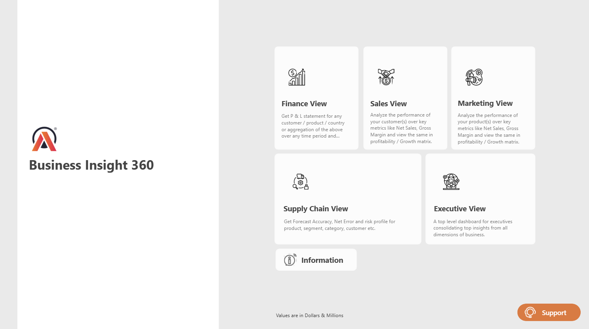

# Business-Analytics-360
🌟 BUSINESS INSIGHTS 360: 🚀

This Power BI dashboard shines a light on Atiq Hardware’s 📈 financial glow, 📉 market vibes, 🔗 supply chain flow, 👥 executive peek, and ⚙️ operational magic. With cool visuals, it guides smart choices, smooths operations, and boosts profits. 🎯 The mission? Lock in Atiq’s market strength and pave the way for epic success! 🌍

🏢 COMPANY VIBE:

Atiq Hardware is a fast-rising 🌐 global tech star, crafting 💻 computers and gear like desktops, laptops, servers, and peripherals (keyboards, mice, monitors, storage). With a solid distribution web 🌐 and tight industry ties, Atiq spreads its magic worldwide, earning a 💪 trusty rep in tech!

❓ CHALLENGE ZONE:

Atiq Hardware, a growing electronics champ across nations, hits a snag with old-school Excel data tricks.

Hurdles: Data moves slow 🐢 and feels clunky, making insights tough to grab.
Ouch Moment: Big losses hit in Latin America lately.
Game Plan: Time to switch to slick data tools for sharp decisions and untapped wins! ✨

## 🧬 DATA MODEL  
📐 The foundation of all insights. This unified data model brings together sales, marketing, finance, supply chain, and executive-level KPIs into one semantic layer.  
📊 **Power BI Star Schema** applied for optimized DAX performance and clarity.

---
🏠 **Home Page**  
Your all-in-one control hub with key KPIs, interactive visuals, and navigation to different views.

## 💼 FINANCE VIEW  
📊 Dive deep into cash flow, cost centers, and net profitability trends.  
💡 Understand where the money’s going—and where it should be going.  
📈 Spot high-margin products and regions with profit potential.

🎥 [Watch Finance View](Finance%20View.mp4)

---

## 💸 MARKETING VIEW  
🎯 Evaluate product performance, campaign effectiveness, and ROI.  
📢 Track conversion funnels and customer acquisition cost (CAC).  
🚀 Identify top-performing SKUs and underperformers to adjust strategies fast.

🎥 [Watch Marketing View](Marketing%20View.mp4)

---

## 👑 EXECUTIVE VIEW  
🧠 Executive summary of all major business KPIs at a glance.  
📍 Enables leadership to take fast, data-backed decisions.  
📅 Track YoY, MoM, and QoQ performance for strategic alignment.

🎥 [Watch Executive View](Executive%20view.mp4)

---

## 📦 SALES VIEW  
🛒 Understand product-level and region-level sales performance.  
🌍 Visualize global and regional trends in sales growth.  
🔍 Drill down into anomalies and uncover upsell opportunities.

🎥 [Watch Sales View](Sales%20View.mp4)

---

## 🚚 SUPPLY CHAIN VIEW  
📦 Track logistics, inventory levels, and vendor performance.  
⏱️ Analyze lead times, delivery delays, and fulfillment rates.  
🔗 Keep the pipeline flowing and customers satisfied.

🎥 [Watch Supply Chain View](Supply%20Chain%20View.mp4)

